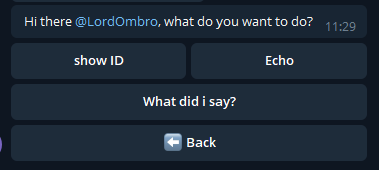

Quickstart
==========
A collection of small guides to get you going fast with the wrapper,
aimed to teach the basics and how to best use the features of this wrapper.

Your first bot
--------------
Let's build a simple echo bot as a first example:

First of all, let's be good programmers and let's setup our main :)

.. code-block:: python

    def main():
        pass

    if __name__ == "__main__":
        main()

To use the bot, you'll need an Access Token. To generate an Access Token,
you have to talk to **@BotFather** and follow a few simple steps
(described `here <https://core.telegram.org/bots#6-botfather>`_).

Now that you have a telegram bot token, let's import what we'll need:
- The bot itself of course
- A TextHandler, basically an object that handles text messages from the user
- A Prompt, basically a 'configurable function' that allow the programmer to send a message.

.. code-block:: python

    from MateWrapper.bot import TelegramBot
    from MateWrapper.handlers import TextHandler
    from MateWrapper.prompts import Prompt

    def main():
        pass

    if __name__ == "__main__":
        main()

There, now that we have what we need, let's put everything together.
To instance a bot, just create a TelegamBot object:

.. code-block:: python

    bot = TelegramBot(token="your bot token", name="your bot name (this is entirely optional)")

then, to add an handler to our newly created bot we just need to call our bots *add_handler* method and pass in
a text handler that itself will call a prompt:

.. code-block:: python

    bot.add_handler(TextHandler(Prompt("you said: {_text}")))

With this instruction we are basically telling the bot that, when it receives a text message,
it should send a text message containing *"you said: {_text}"*.

Speaking of  ``Prompts`` (docs here: :ref:`MateWrapper package:prompts module`), whenever you put a word between curly
brackets in the text, you are giving the prompt a **context directive**, these can be of many different types,
in our case we are using a special type of directive exclusive to prompts that will be replace with the
text that the user just sent.

For more info about **context directives**, see :doc:`Context directives`.

Back to our echo bot, it's finished! Now all we have to do is start it, which you can with the following instruction:

.. code-block:: python

    bot.start_and_idle()

And there you go! We are done! Here's how your entire bot should look like:

.. code-block:: python

    from MateWrapper.bot import TelegramBot
    from MateWrapper.handlers import TextHandler
    from MateWrapper.prompts import Prompt

    def main():
        bot = TelegramBot(token="your bot token", name="your bot name (this is entirely optional)")
        bot.add_handler(TextHandler(Prompt("you said: {_text}")))
        bot.start_and_idle()

    if __name__ == "__main__":
        main()

That wasn't so bad, was it?

Now when you start the bot (assuming the token you used is valid) and write for exaple "hi" to it,
it should respond with "you said: hi".

3 lines of code for an echo bot is pretty good, but keep reading, it gets better ;)

Using Menus
-----------
Now, while Prompts are quite convenient & Building bots that echo what you said or tell you your name/id is pretty cool,
where this wrapper gets spicy is with the introduction Menus, Panels & Buttons

For example let's take a look at **tests/choice_sample.py**:

.. code-block:: python

    from telegram.ext import CommandHandler

    from MateWrapper.bot import TelegramBot
    from MateWrapper.globals import Globals
    from MateWrapper.prompts import Prompt
    from MateWrapper.handlers import TextHandler
    from MateWrapper.variables import GetText

    from MateMenus.buttons import FuncButton, InputButton
    from MateMenus.generics import Menu
    from MateMenus.panels import Panel

    def main():
        bot = TelegramBot("[Your token]", name="test")
        bot.add_handler(Menu(
            entry_points=[CommandHandler("start", Globals.ENTRY_POINT)],
            panels={
                "main": Panel(
                    "Hi there {__name}, what do you want to do?",
                    [
                        [
                            FuncButton(
                                "show ID",
                                Prompt("Your id is `{__id}`")
                            ),
                            InputButton(
                                "Echo",
                                Prompt("okay, send some text", delete_last_message=True, keyboard=Globals.BACK_KEYBOARD),
                                TextHandler(GetText("text"))
                            )
                        ],
                        FuncButton(
                            "What did i say?",
                            Prompt("You said: '{text}'")
                        ),
                    ],
                    back_to=Globals.CLOSE_MENU,
                )
            },
            main_panel="main",
            fallbacks=[CommandHandler("end", Globals.END_HANDLER)]
        ))
        bot.add_handler(
            CommandHandler("about", Prompt(
                "Bot made by [SudoOmbro](https://github.com/SudoOmbro)",
                use_markdown=True)
            )
        )
        bot.start_and_idle()

    if __name__ == '__main__':
        main()

With 36 (less than 36 actually, most of them are lines with one character)
lines of code we built a fully fledged telegram bot that looks like this when started:

It even has a "/about" command and it can store & print a variable the user inputs!
How was it achieved? Let's look at the various components:

- **CommandHandler**:
    This is just an Handler imported from telegram.ext, note that all base handlers found in telegram.ext are 100%
    compatible with the wrapper, as they are the base for it's own implementation of handlers.

    This handler will only handle "/command" messages.
- **Menu**:
    This is one of the most important handlers that comes with MATE, it is **used for building keyboard based menus**
    in a simple & intuitive way.

    It's basically a wrapper over ``telegram.ext.ConversationHandler`` that, instead of having you manually setup
    conversation states, the handlers tied to each conversation state & callbacks, will automatically generate
    everything starting from a Dictionary of panels.

    Why a dictionary? So that the string key assigned to a ``Panel`` becomes said ``Panel``'s name
    that you can reference from other panels, thus creating "Submenus".

    Also, what is ``Globals.ENTRY_POINT``? Well, that is a placeholder function that will be **replaced automatically**
    by the ``Menu`` at init time with the ``Prompt`` from the Panel set as the main one (this is done by setting the
    ``main_panel`` parameter to the name of the ``Panel`` you want to be the main one), thus letting the user access
    it when on of the ``entry_points`` handlers conditions is satisfied.
- **Panel**:
    But what is a Panel? Well, on a purely code based level, it's just an ordered collection of ``Button`` objects and
    of extra handlers. On a more conceptual level, you can see a Panel basically as a "view" of the menu, a "submenu"
    if you will, basically just a Prompt with buttons that do stuff.

    As you can see from :ref:`MateMenus package:panels module`, you can pass a few values when creating a panel, the most important one of these
    being ``buttons``, this parameter will determine not only how the panel will look, but also what the buttons will do.
    ``buttons`` is a **list of either buttons or lists of buttons**, basically the first level of the list determines the
    row in which the button(s) will appear, while the second level of list will determine the column of the button. So:

    .. code-block:: python

        buttons = [
            [button1, button2],
            [button3]
        ]

    will appear as:

    .. image:: _static/button_schema_example.png
        :width: 400
- **FuncButton**:
    An implementation of the generic ``Button`` class (documented in :ref:`MateMenus package:buttons module`) that
    executes the function passed to it through the ``function`` parameter when clicked.
- **InputButton**:
    A special kind of button that will **automatically generate it's state & callback to get an input from the user**.
    In order to support a generic input, an handler (or a list of handlers) with a callback already setup needs to be
    passed to this button through the input ``input_handlers`` parameter.

    A ``Prompt`` also needs to be passed to this button; Said prompt will be displayed to
    the user when awaiting for his/her input.
- **GetText**:
    An implementation of ``GetVariableGeneric``,
    this function automatically accesses the latest update from the user and puts the received text in the specified
    place (either trough a **Context directive**, documented in :doc:`Context directives`, or a ``custom setter function``).

    Optionally it can even transform the input through a ``transformation function``.

    Other types of getters also exist, see :ref:`MateWrapper package:variables module` for more info.

Advanced usage
--------------
This section will talk a bit about some of the more advanced features of MATE,
for an example that uses **most of them** refer to:

.. automodule:: samples.todo_list_bot
    :members:

Chains
~~~~~~
Chains are **a way of chaining together multiple functions** in a single handler, allowing you to create subroutines
that spare you code repetition. They can be put anywhere a callback should go (generally inside an ``Handler``)
and you can even put chains inside other chains!

see ``Chain`` in :ref:`MateWrapper package:generics module` for more info

Custom Panels
~~~~~~~~~~~~~
A bare bones implementation of the ``GenericPanel`` class that lets you customize
the panel's prompt in detail and requires you to setup every single handler yourself.
A good example of this Type on panel's usage can be found in the TODO list sample you
can find reference at the start of this paragraph.

Useful if you want to build an highly custom and dynamic panel inside your menu.

See ``CustomPanel`` in :ref:`MateMenus package:panels module` for more info.

Decorating Panels
~~~~~~~~~~~~~~~~~
All panels can be decorated (wrapped by another kind of panel) by using panel decorators; These classes can be used
to easily add functionality to an entire panel without repeating yourself.

See :ref:`MateMenus package:panel decorators module` for more info.

Generating keyboards from lists
~~~~~~~~~~~~~~~~~~~~~~~~~~~~~~~
Sometimes you need to generate dynamic keyboards from lists of things, since i found it to be a pretty
common occurrence i built some helper functions that make doing it pretty easy:

- ``get_keyboard_from_list``:
    lets you generate a keyboard in a pretty standard way, automatically taking care of how the buttons are
    generated while letting you define a few parameters of the generated keyboard.
- ``get_keyboard_from_list_custom_row``:
    lets you get more "low level" with the keyboard generation, requiring you to pass in a function that
    will be used to generate a row of the keyboard.

See :ref:`MateMenus package:keyboards module` for more info on both functions.
